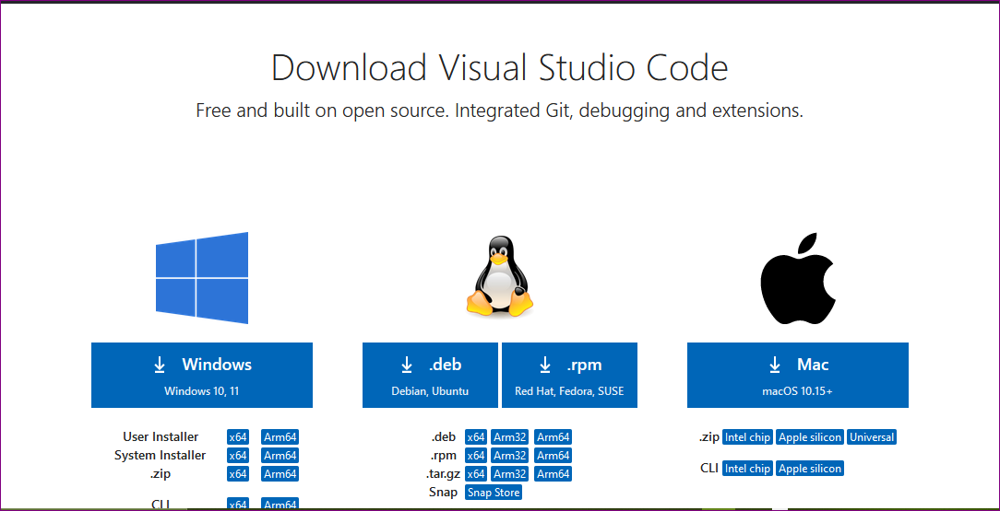
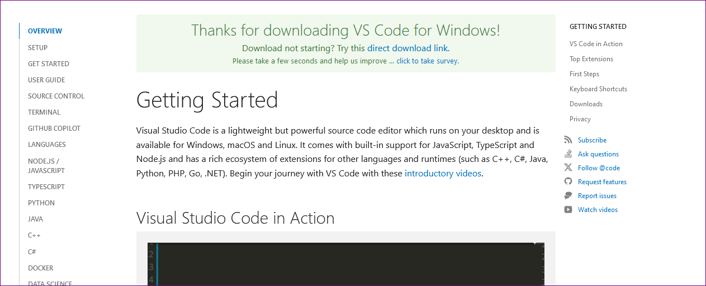
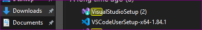
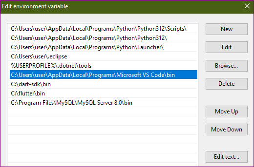
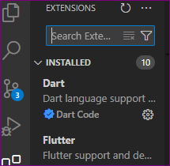
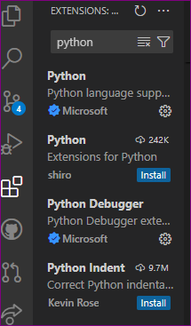

# SE-Assignment-5
Installation and Navigation of Visual Studio Code (VS Code)
 Instructions:
Answer the following questions based on your understanding of the installation and navigation of Visual Studio Code (VS Code). Provide detailed explanations and examples where appropriate.

 Questions:

1. Installation of VS Code:
   - Describe the steps to download and install Visual Studio Code on Windows 11 operating system. Include any prerequisites that might be needed.
   step 1. open the following link on your browser https://code.visualstudio.com/download and you will see the homepage of visual studio code you need to download as shown 
   
   step 2. download visual studio code for windows and you will see  the following page
   
   step 3. go to your downloaded file and search the downloaded file of visual studio as shown below
   
   step 4.install the visual studio code to your laptop and follow the promps during installation eg of a prompt is where the vs code will be located.
   step 5. after installing the visual studio, copy the path of vscode and then go to the environmental setup where you will add the vs code path to your laptop as shown below
   
   step.6 open the visual studio so as to launch as a visual studio interface showing "welcome to visual studio code" will be displayed. 

2. First-time Setup:
   - After installing VS Code, what initial configurations and settings should be adjusted for an optimal coding environment? Mention any important settings or extensions.
      for a first time setup, the following settings must be done;
      a. theme- an individual chooses the theme of his or her choice depending on his or her prefrences.
      b. code snippets- configure the snippets for the codes you will b working on with.
      c. font - set the fonts , size and style to what you desire.
      d. indentation - you will be neede to set the size and style indentation.
   `  d. code completion- activate auto-completion.
      e. debugging - configure debuggings such as step-over and step-into.

      the following extensions are created;
      a. code actions - these are actions for coding programs such as renaming variables.
      b. code ruuner - allows you to run a code in a different process making it easier to test and debug codes.
      c. gitlens - this is a git extension taht provides visual indicators of git changes such as committing.
      d. ESLint - helps to find where there are errors and enforce coding standards.
      e. Prettier - enables the code to be clean as you continue coding.

3. User Interface Overview:
   - Explain the main components of the VS Code user interface. Identify and describe the purpose of the Activity Bar, Side Bar, Editor Group, and Status Bar.
      a. menu bar - located at the top and provides various menus and commands eg file, edit, selection, view,go ,run
      b  quick access panel - located at the top right. enables an individual to search recent files and folders.
      C. title bar - located at the top. used to show the title of the programa nd file name. it also has features like minimize,close and maximize.
      d. side bar- located at the left side that shows explorer, extensions, debug and terminal.
      e. activity bar- located on the left side and provides a bird's-eye view of all your open folders, files, and extensions. It allows you to view files and folders, manage extensios, access debugger and switch between files and folders. 
      f. editor group - a place where you write and edit code. it contains different editors which include;
            1. code editor - has code completion, syntax highlighting etc.
            2. editor actions - provide actions for coding programs such as renaming variables.
            3. editor settings -customizes editor such as fonts, size,line spacing etc.
      g. status bar - located at the bottom which provides information about the current state of the codes which are;
            1. line number - provides the current number in the line.
            2. path - this is the current path being used.
            3. code lens-these are the snippets being edited.
            4. status messages-  the current status information of the code.

4. Command Palette:
   - What is the Command Palette in VS Code, and how can it be accessed? Provide examples of common tasks that can be performed using the Command Palette.
    a command Palette is a feature that enables you to use keyboard shortcut to access various commands and actions.
      a command palette can be accesessed in various ways such as;
         1.Keyboard Shortcut -  Ctrl + Shift + P or Ctrl + Shift + Space or F1 key
         2.  command Palette Icon- Click on the Command Palette icon () located in the top-right corner.
         3. menu >view>command palette.
      examples of common tasks performed by command palettes are
         1.new file- ctrl +N
         2. save file - ctrl + S
         3. open file - ctrl + K
         4. format code - shift +alt+ F
         5. definition - F12
         6. symbol - ctrl+ shift+ O
   

5. Extensions in VS Code:
   - Discuss the role of extensions in VS Code. How can users find, install, and manage extensions? Provide examples of essential extensions for web development.
      the role of extensions in vs code is that they provide features and functionality to the editor which enhances the editors functionality and gives specific tools for specific tasks.
      users can find, install and manage extenstions by;
         1. cicking on the left side bar.
         2. searching to the extensions that one requires on the search bar.
         
         3. navigating on the extension gallery by clicking on browse button.
         4. click on install button to install the extension you require.
         
      examples of essential extensions for web development are;
         1. live server- allows user to run a local development server for web development.
         2. prettier - formats code according to specific style.
         3. htmlhint- provides html syntax checking and linting.
         4. eslint - provides code analysis and linting for javascript code.
         5. debugger for chrome-  allows the user to debug web software in chrome.

6. Integrated Terminal:
   - Describe how to open and use the integrated terminal in VS Code. What are the advantages of using the integrated terminal compared to an external terminal?
      you can use shortcut to open and use intergrated terminal by pressing (ctrl + shift + windows) or by clicking on the terminal icon at the top menu bar.
      advantages of using the intergrated terminal compared to an external terminal include;
         1. code completion - provides code completion for commands and scripts.
         2. intergration - as it is intergrated, it allows a person to easily run commands and scripts.
         3. convenience - access of the intergrated terminal is granted within the editor.

7. File and Folder Management:
   - Explain how to create, open, and manage files and folders in VS Code. How can users navigate between different files and directories efficiently?
      one can create a new file by using the shortcut (ctrl + N) or click on the file and select new file.
      one can open a file by suing the shortcut (ctrl + o)or click on the file and select open file.
      one can manage file and folders by using the explorer panel to navigate through files and folders and perform different tasks such as  renaming, deleting and creating files and folders.

8. Settings and Preferences:
   - Where can users find and customize settings in VS Code? Provide examples of how to change the theme, font size, and keybindings.
      user can find and customize settings by;
         1. clicking on the file >preferences >settings or using shortcut (ctrl + shift + p)
         2. customize settings by using the setting editor to change theme, font size, and key bindings.
      example of changing theme, font size and keybindings.
         1. theme - click on theme and select theme from the  setting editors list.
         2. font size - click on font size and select the font size you what from the setting editors drop down menu.
         3. keybindings- click on the keybindings tab and change to your liking.

9. Debugging in VS Code:
   - Outline the steps to set up and start debugging a simple program in VS Code. What are some key debugging features available in VS Code?
      step 1. create a new file- create a file with .js extension.
      step 2. write code- write a javascript cod ein the file.
      step 3. set breakpoints - click on the line number in where you want to pause execution to set breakpoints.
      step 4. start debugging - click on the debug from the top menu bar.
   debugging features available in vs code include;
   breakpoints, inspecting variables, stepping into code etc

10. Using Source Control:
    - How can users integrate Git with VS Code for version control? Describe the process of initializing a repository, making commits, and pushing changes to GitHub.
      a user can intergrate git with vs code by; initializing a repository,making changes by using git add . and git commit and finalling pushing the changes to github using git push.
      the process of initializing a repository, making commits and pushing changes to github  is as follows;
         1. Initialize a repository: Open a folder and choose Source Control icon in the bottom left corner.
         2. making commits by using git add . and git commit.
         3. pushing changes to github by using the git push command.
         4. after selecting the git push command your changes will be made on github and commits will be activated.

 Submission Guidelines:
- Your answers should be well-structured, concise, and to the point.
- Provide screenshots or step-by-step instructions where applicable.
- Cite any references or sources you use in your answers.
- Submit your completed assignment by 1st July 

